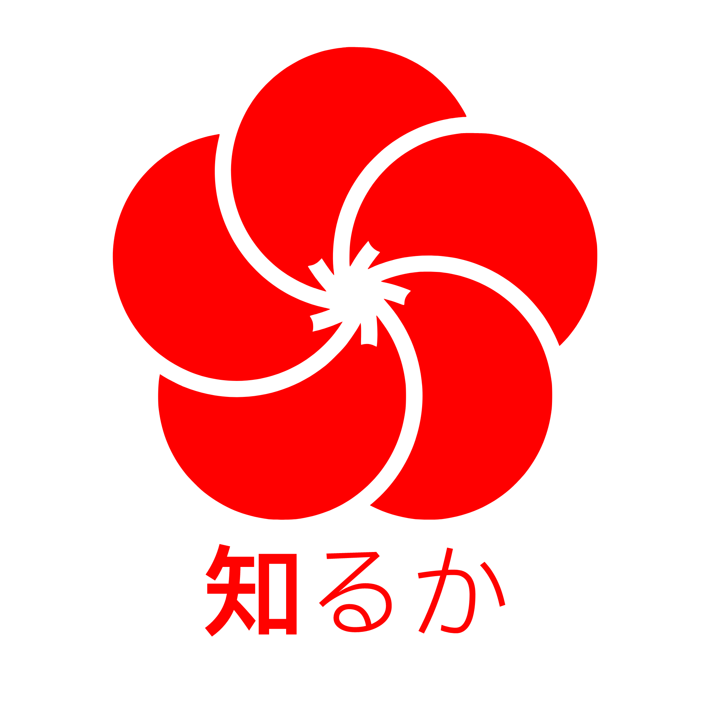

<h1 align="center">Shiru ka API</h1>

<strong>An API project that helps developers to create unique plugins for Shiru ka.</strong>

<h3 align="center">
  <a href="http://docs.shiruka.net">Documentation</a>
/
  <a href="http://ci.shiruka.net">CI</a>
</h3>
